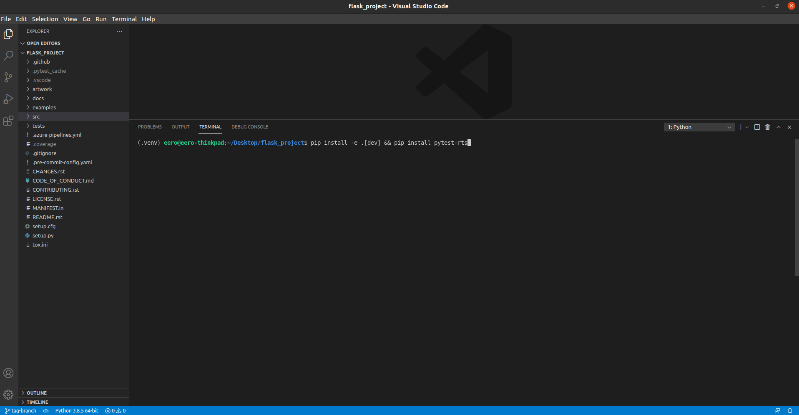
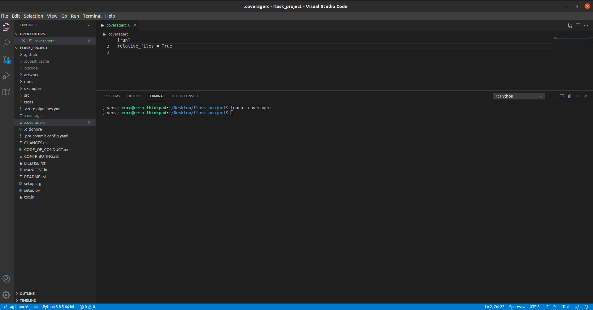
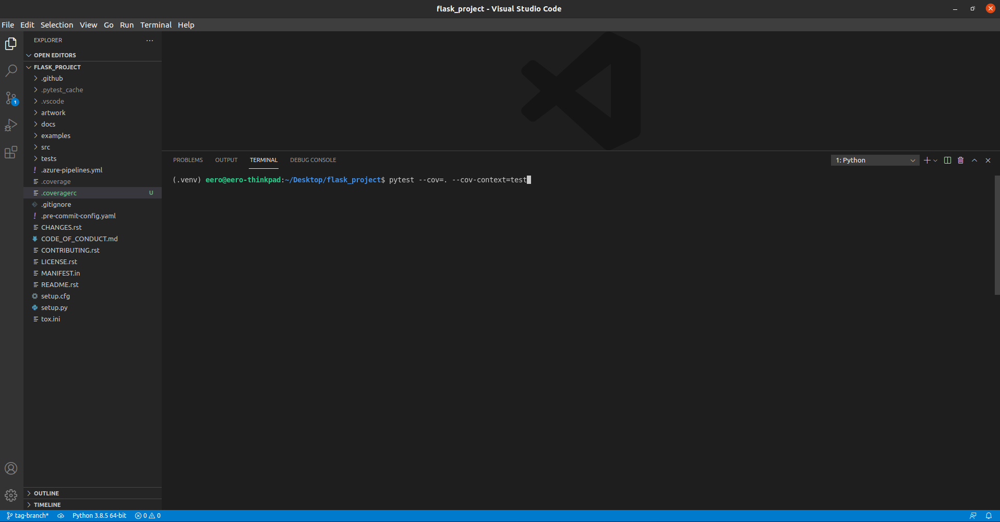
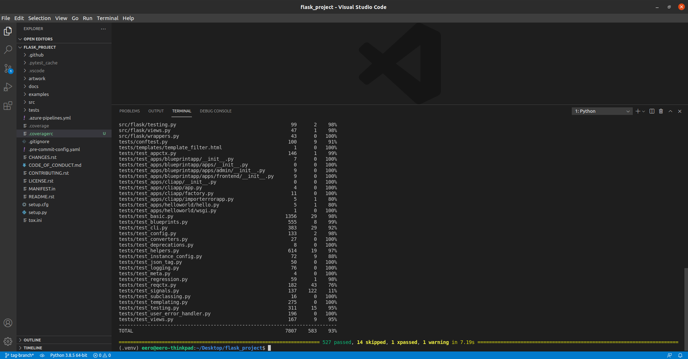
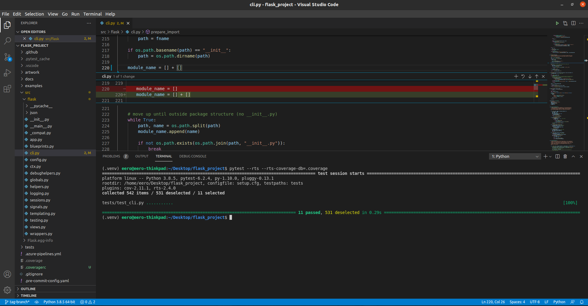
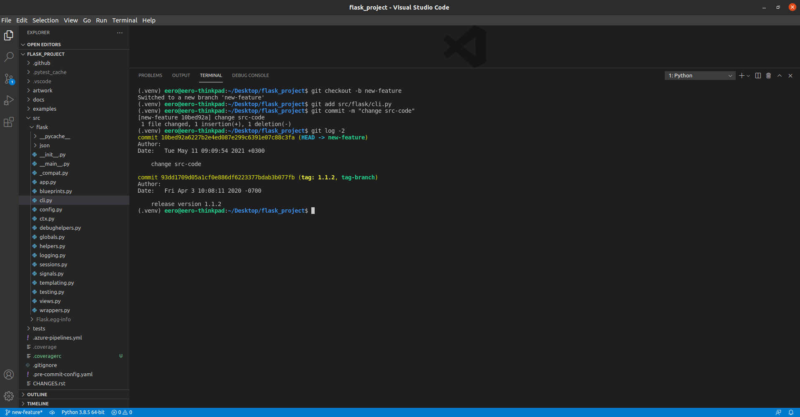
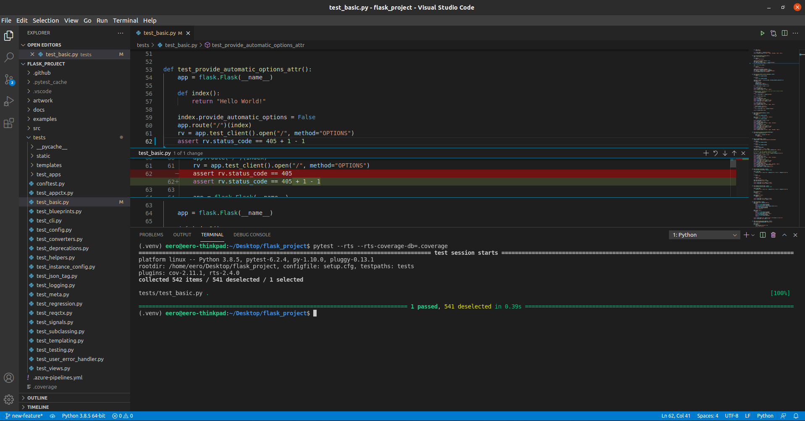
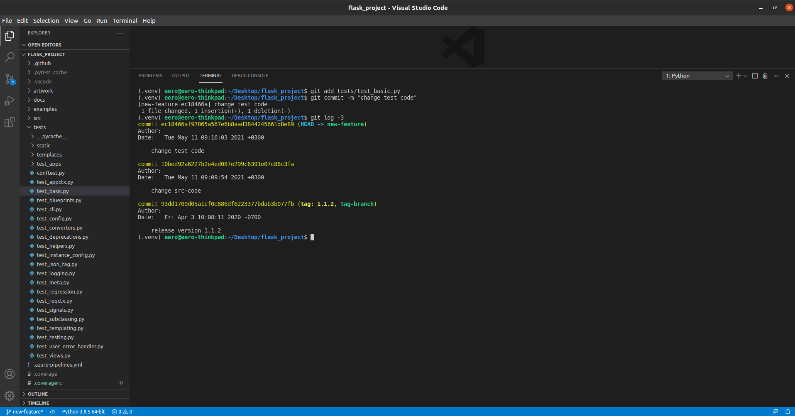
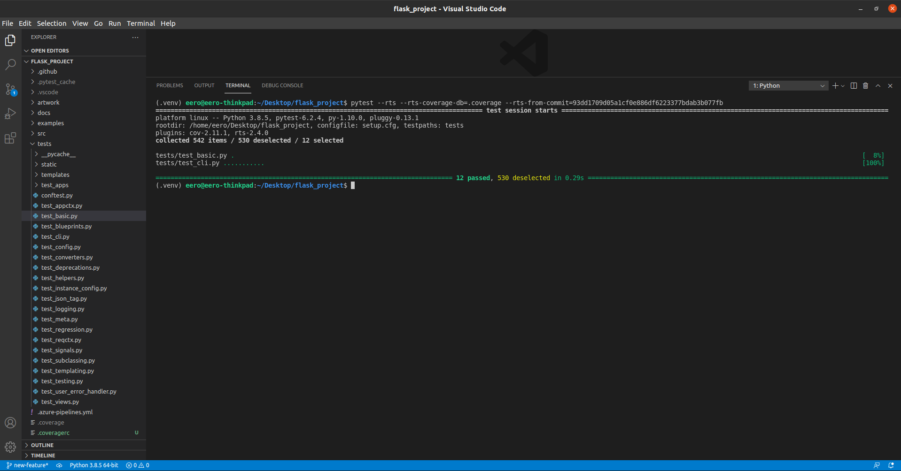

# Tutorial on using pytest-rts in an open source project

## Requirements

* Python  >= 3.6.6
* Git

## Setting up

This tutorial uses [flask](https://github.com/pallets/flask) (version `1.1.2`) as an example.

1. Clone [flask](https://github.com/pallets/flask) and install the dependencies + `pytest-rts`

2. Follow the steps in [README](../README.md) to configure and build the mapping database

## Use the test selection feature

Follow the steps in [README](../README.md) to use pytest-rts. Screenshots illustrate the outcome with simple changes.

1. Change a file and run the tests for it

2. Commit changes to a new branch

3. Change another file and run tests for it

4. Commit the second change

5. Run tests for both commits

